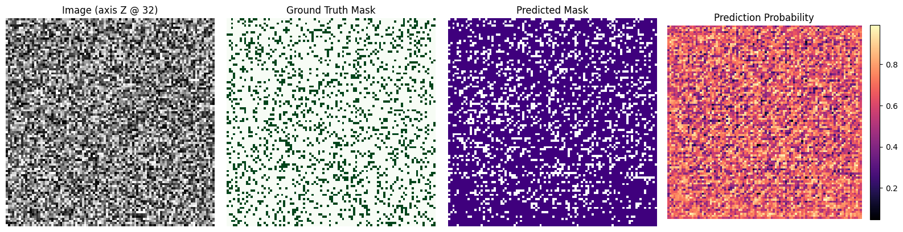

# ISLES'22 Ensemble Strategies with MONAI

This notebook implements bagging, boosting, and stacking ensembles for ischemic stroke lesion segmentation on the ISLES'22 pre-processed dataset using MONAI. It assumes that the pre-processed data has been downloaded locally (see the setup cell below for expected directory structure).


## 1. Environment Setup

- Python 3.10+
- `torch` 2.0+ with CUDA if available
- `monai` 1.3+
- `numpy`, `pandas`, `matplotlib`, `scikit-learn`
- Optional: `tqdm`, `tensorboard`

Expected directory layout after downloading the ISLES'22 pre-processed data from Google Drive:

```
/data/isles22/
    imagesTr/
        case_0001.nii.gz
        ...
    labelsTr/
        case_0001_seg.nii.gz
        ...
    imagesVal/
    labelsVal/
```

Update `DATA_ROOT` in the configuration cell if your paths differ. If the dataset is not present, the notebook can be run in dry-run mode using a synthetic dataset for debugging.


```python
# If running in a fresh environment, uncomment the following line to install dependencies.
# !pip install --upgrade pip
# !pip install "torch>=2.0" "monai-weekly[nibabel,tqdm,ignite]" scikit-learn pandas matplotlib

```


```python
import os
import json
from dataclasses import dataclass
from pathlib import Path
from typing import Dict, List, Optional, Sequence, Tuple

import numpy as np
import matplotlib.pyplot as plt
import torch
from monai.config import print_config
from monai.data import CacheDataset, DataLoader, Dataset, decollate_batch
from monai.metrics import DiceMetric, HausdorffDistanceMetric
from monai.networks.nets import UNet
from monai.losses import DiceCELoss
from monai.transforms import (
    Activationsd,
    AsDiscreted,
    EnsureChannelFirstd,
    EnsureTyped,
    Compose,
    Invertd,
    LoadImaged,
    MapTransform,
    RandAffined,
    RandZoomd,
    RandFlipd,
    RandSpatialCropd,
    SaveImaged,
    ScaleIntensityRanged,
)
from monai.utils import set_determinism
from torch import nn, optim
from torch.utils.tensorboard import SummaryWriter
from tqdm.auto import tqdm
from sklearn.model_selection import train_test_split
from sklearn.linear_model import LogisticRegression

print_config()

device = torch.device("cuda" if torch.cuda.is_available() else "cpu")
print(f"Using device: {device}")

```

    MONAI version: 1.5.1


    Numpy version: 2.3.4


    Pytorch version: 2.9.0+cpu


    MONAI flags: HAS_EXT = False, USE_COMPILED = False, USE_META_DICT = False
    MONAI rev id: 9c6d819f97e37f36c72f3bdfad676b455bd2fa0d
    MONAI __file__: /home/<username>/.local/lib/python3.12/site-packages/monai/__init__.py


    
    Optional dependencies:


    Pytorch Ignite version: NOT INSTALLED or UNKNOWN VERSION.


    ITK version: NOT INSTALLED or UNKNOWN VERSION.


    Nibabel version: NOT INSTALLED or UNKNOWN VERSION.


    scikit-image version: NOT INSTALLED or UNKNOWN VERSION.


    scipy version: 1.16.3


    Pillow version: 12.0.0


    Tensorboard version: 2.20.0


    gdown version: NOT INSTALLED or UNKNOWN VERSION.


    TorchVision version: 0.24.0+cpu


    tqdm version: 4.67.1


    lmdb version: NOT INSTALLED or UNKNOWN VERSION.


    psutil version: 7.1.2


    pandas version: NOT INSTALLED or UNKNOWN VERSION.


    einops version: NOT INSTALLED or UNKNOWN VERSION.


    transformers version: NOT INSTALLED or UNKNOWN VERSION.


    mlflow version: NOT INSTALLED or UNKNOWN VERSION.


    pynrrd version: NOT INSTALLED or UNKNOWN VERSION.


    clearml version: NOT INSTALLED or UNKNOWN VERSION.


    
    For details about installing the optional dependencies, please visit:


        https://docs.monai.io/en/latest/installation.html#installing-the-recommended-dependencies
    


    Using device: cpu


```python
@dataclass
class ExperimentConfig:
    data_root: Path = Path("/data/isles22")
    images_subdir: str = "imagesTr"
    labels_subdir: str = "labelsTr"
    val_images_subdir: Optional[str] = "imagesVal"
    val_labels_subdir: Optional[str] = "labelsVal"
    cache_rate: float = 0.1
    num_workers: int = 4
    roi_size: Tuple[int, int, int] = (96, 96, 64)
    batch_size: int = 2
    base_lr: float = 1e-4
    max_epochs: int = 100
    patience: int = 20
    n_bagging_models: int = 5
    boosting_rounds: int = 4
    stacking_meta_epochs: int = 50
    amp: bool = True
    num_classes: int = 2
    in_channels: int = 1
    seed: int = 42
    validation_split: float = 0.2
    synthetic_samples: int = 10  # used for dry-run mode when data is unavailable


cfg = ExperimentConfig()
set_determinism(seed=cfg.seed)

```


```python
def check_dataset_availability(cfg: ExperimentConfig) -> bool:
    image_dir = cfg.data_root / cfg.images_subdir
    label_dir = cfg.data_root / cfg.labels_subdir
    available = image_dir.exists() and label_dir.exists()
    if available:
        print(f"Found dataset at {cfg.data_root}")
    else:
        print(
            "Dataset not found. Enable dry-run mode by generating synthetic data or update cfg.data_root."
        )
    return available


data_available = check_dataset_availability(cfg)

```

    Dataset not found. Enable dry-run mode by generating synthetic data or update cfg.data_root.


```python
def build_file_lists(cfg: ExperimentConfig) -> Tuple[List[Dict[str, str]], List[Dict[str, str]]]:
    if not data_available:
        print("Running in synthetic mode with random tensors for debugging.")
        temp_dir = Path("./synthetic_isles22")
        temp_dir.mkdir(exist_ok=True)
        np.random.seed(cfg.seed)
        samples = []
        for idx in range(cfg.synthetic_samples):
            image_path = temp_dir / f"image_{idx}.npy"
            label_path = temp_dir / f"label_{idx}.npy"
            np.save(image_path, np.random.rand(1, *cfg.roi_size).astype(np.float32))
            np.save(label_path, (np.random.rand(1, *cfg.roi_size) > 0.8).astype(np.uint8))
            samples.append({"image": str(image_path), "label": str(label_path)})
        train_samples, val_samples = train_test_split(
            samples, test_size=cfg.validation_split, random_state=cfg.seed
        )
        return train_samples, val_samples

    image_dir = cfg.data_root / cfg.images_subdir
    label_dir = cfg.data_root / cfg.labels_subdir
    image_files = sorted([p for p in image_dir.glob("*.nii*")])
    label_files = sorted([p for p in label_dir.glob("*.nii*")])
    assert len(image_files) == len(label_files), "Mismatch between images and labels"
    data = [{"image": str(i), "label": str(l)} for i, l in zip(image_files, label_files)]

    if cfg.val_images_subdir and cfg.val_labels_subdir:
        val_images = sorted((cfg.data_root / cfg.val_images_subdir).glob("*.nii*"))
        val_labels = sorted((cfg.data_root / cfg.val_labels_subdir).glob("*.nii*"))
        if val_images and val_labels:
            val_data = [
                {"image": str(i), "label": str(l)} for i, l in zip(val_images, val_labels)
            ]
            return data, val_data

    train_data, val_data = train_test_split(
        data, test_size=cfg.validation_split, random_state=cfg.seed
    )
    return train_data, val_data


train_files, val_files = build_file_lists(cfg)
print(f"Train samples: {len(train_files)}, Validation samples: {len(val_files)}")

```

    Running in synthetic mode with random tensors for debugging.


    Train samples: 8, Validation samples: 2


```python
class LoadVolume(MapTransform):
    """Load NIfTI or NumPy volumes into memory."""

    def __init__(self, keys: Sequence[str]):
        super().__init__(keys)
        self.nifti_loader = LoadImaged(keys=keys)

    def __call__(self, data):
        d = dict(data)
        for key in self.keys:
            path = d[key]
            if str(path).endswith(".npy"):
                d[key] = np.load(path)
            else:
                loaded = self.nifti_loader({key: path})
                d[key] = loaded[key]
        return d

```


```python
def get_transforms(cfg: ExperimentConfig, augment: bool = True):
    load = LoadVolume(keys=["image", "label"])
    common = [
        EnsureChannelFirstd(keys=["image", "label"], channel_dim=0),
        EnsureTyped(keys=["image", "label"], dtype=torch.float32),
    ]
    if data_available:
        intensity = ScaleIntensityRanged(
            keys=["image"],
            a_min=-200,
            a_max=200,
            b_min=0.0,
            b_max=1.0,
            clip=True,
        )
    else:
        intensity = ScaleIntensityRanged(keys=["image"], a_min=0.0, a_max=1.0, b_min=0.0, b_max=1.0)

    aug = []
    if augment:
        aug.extend(
            [
                RandSpatialCropd(keys=["image", "label"], roi_size=cfg.roi_size, random_size=False),
                RandFlipd(keys=["image", "label"], prob=0.5, spatial_axis=0),
                RandFlipd(keys=["image", "label"], prob=0.5, spatial_axis=1),
                RandFlipd(keys=["image", "label"], prob=0.5, spatial_axis=2),
                RandZoomd(keys=["image", "label"], prob=0.2, min_zoom=0.9, max_zoom=1.1),
                RandAffined(
                    keys=["image", "label"],
                    prob=0.15,
                    translate_range=[10, 10, 5],
                    rotate_range=[np.pi / 18] * 3,
                    padding_mode="border",
                ),
            ]
        )
    else:
        aug.append(
            RandSpatialCropd(
                keys=["image", "label"], roi_size=cfg.roi_size, random_size=False, random_center=False
            )
        )

    post = [EnsureTyped(keys=["image", "label"], dtype=torch.float32)]

    return Compose([load, *common, intensity, *aug, *post])


def create_datasets(cfg: ExperimentConfig):
    train_transforms = get_transforms(cfg, augment=True)
    val_transforms = get_transforms(cfg, augment=False)

    train_ds = CacheDataset(train_files, transform=train_transforms, cache_rate=cfg.cache_rate)
    val_ds = CacheDataset(val_files, transform=val_transforms, cache_rate=cfg.cache_rate)
    return train_ds, val_ds


def create_dataloader(dataset, batch_size, shuffle=True, sample_weights=None):
    if sample_weights is not None:
        sampler = torch.utils.data.WeightedRandomSampler(
            weights=torch.tensor(sample_weights, dtype=torch.double),
            num_samples=len(sample_weights),
            replacement=True,
        )
        shuffle = False
    else:
        sampler = None

    return DataLoader(
        dataset,
        batch_size=batch_size,
        shuffle=shuffle and sampler is None,
        sampler=sampler,
        num_workers=cfg.num_workers,
        pin_memory=torch.cuda.is_available(),
    )


train_ds, val_ds = create_datasets(cfg)
train_loader = create_dataloader(train_ds, cfg.batch_size, shuffle=True)
val_loader = create_dataloader(val_ds, batch_size=1, shuffle=False)

```


```python
def create_unet(cfg: ExperimentConfig) -> nn.Module:
    model = UNet(
        spatial_dims=3,
        in_channels=cfg.in_channels,
        out_channels=cfg.num_classes,
        channels=(16, 32, 64, 128, 256),
        strides=(2, 2, 2, 2),
        num_res_units=2,
        dropout=0.1,
    )
    return model.to(device)

```


```python
dice_metric = DiceMetric(include_background=False, reduction="mean")
hausdorff_metric = HausdorffDistanceMetric(include_background=False, percentile=95)
post_trans = Compose(
    [
        Activationsd(keys="pred", softmax=True),
        AsDiscreted(keys="pred", argmax=True, to_onehot=cfg.num_classes),
        AsDiscreted(keys="label", to_onehot=cfg.num_classes),
    ]
)
loss_fn = DiceCELoss(to_onehot_y=True, softmax=True)


def train_one_epoch(model, loader, optimizer, scaler=None):
    model.train()
    epoch_loss = 0.0
    for batch_data in tqdm(loader, desc="Train", leave=False):
        images = batch_data["image"].to(device)
        labels = batch_data["label"].to(device)
        optimizer.zero_grad(set_to_none=True)
        with torch.cuda.amp.autocast(enabled=cfg.amp):
            outputs = model(images)
            loss = loss_fn(outputs, labels)
        if scaler is not None and cfg.amp:
            scaler.scale(loss).backward()
            scaler.step(optimizer)
            scaler.update()
        else:
            loss.backward()
            optimizer.step()
        epoch_loss += loss.item()
    return epoch_loss / max(1, len(loader))


def validate(model, loader):
    model.eval()
    dice_metric.reset()
    hausdorff_metric.reset()
    val_loss = 0.0
    with torch.no_grad():
        for batch_data in tqdm(loader, desc="Validate", leave=False):
            images = batch_data["image"].to(device)
            labels = batch_data["label"].to(device)
            with torch.cuda.amp.autocast(enabled=cfg.amp):
                outputs = model(images)
                loss = loss_fn(outputs, labels)
            val_loss += loss.item()
            data = {"pred": outputs, "label": labels}
            data_list = [post_trans(i) for i in decollate_batch(data)]
            for item in data_list:
                dice_metric(item["pred"], item["label"])
                hausdorff_metric(item["pred"], item["label"])
    avg_dice = dice_metric.aggregate().item()
    avg_hd = hausdorff_metric.aggregate().item()
    return val_loss / max(1, len(loader)), avg_dice, avg_hd


def early_stopping_training(model, train_loader, val_loader, cfg: ExperimentConfig, run_name: str):
    optimizer = optim.AdamW(model.parameters(), lr=cfg.base_lr, weight_decay=1e-5)
    scheduler = optim.lr_scheduler.CosineAnnealingLR(optimizer, T_max=cfg.max_epochs)
    scaler = torch.cuda.amp.GradScaler(enabled=cfg.amp)
    best_score = -np.inf
    best_state = None
    patience_counter = 0

    writer = SummaryWriter(log_dir=f"runs/{run_name}")

    for epoch in range(cfg.max_epochs):
        train_loss = train_one_epoch(model, train_loader, optimizer, scaler)
        val_loss, val_dice, val_hd = validate(model, val_loader)
        scheduler.step()

        writer.add_scalar("Loss/train", train_loss, epoch)
        writer.add_scalar("Loss/val", val_loss, epoch)
        writer.add_scalar("Metrics/dice", val_dice, epoch)
        writer.add_scalar("Metrics/hausdorff", val_hd, epoch)

        score = val_dice
        if score > best_score:
            best_score = score
            best_state = model.state_dict()
            patience_counter = 0
        else:
            patience_counter += 1

        print(
            f"Epoch {epoch+1}/{cfg.max_epochs} - Train Loss: {train_loss:.4f}, Val Dice: {val_dice:.4f}, Val HD95: {val_hd:.2f}"
        )

        if patience_counter >= cfg.patience:
            print("Early stopping triggered.")
            break

    writer.close()
    if best_state is not None:
        model.load_state_dict(best_state)
    return model, best_score

```


```python
def train_bagging_ensemble(cfg: ExperimentConfig, train_ds, val_loader):
    models: List[nn.Module] = []
    scores: List[float] = []
    for model_idx in range(cfg.n_bagging_models):
        bootstrap_indices = np.random.choice(len(train_ds), size=len(train_ds), replace=True)
        sample_counts = np.bincount(bootstrap_indices, minlength=len(train_ds))
        sample_weights = sample_counts.astype(np.float32) + 1e-3
        loader = create_dataloader(
            train_ds, batch_size=cfg.batch_size, shuffle=False, sample_weights=sample_weights
        )
        model = create_unet(cfg)
        run_name = f"bagging/model_{model_idx}"
        model, score = early_stopping_training(model, loader, val_loader, cfg, run_name)
        models.append(model)
        scores.append(score)
    return models, scores

```


```python
def build_evaluation_dataset(files):
    eval_transforms = Compose(
        [
            LoadVolume(keys=["image", "label"]),
            EnsureChannelFirstd(keys=["image", "label"]),
            EnsureTyped(keys=["image", "label"], dtype=torch.float32),
        ]
    )
    return CacheDataset(files, transform=eval_transforms, cache_rate=0.0)


def compute_sample_errors(model: nn.Module, files: List[Dict[str, str]]):
    eval_ds = build_evaluation_dataset(files)
    loader = DataLoader(eval_ds, batch_size=1, shuffle=False, num_workers=cfg.num_workers)
    errors = []
    metric = DiceMetric(include_background=False, reduction="mean")
    model.eval()
    with torch.no_grad():
        for batch_data in loader:
            images = batch_data["image"].to(device)
            labels = batch_data["label"].to(device)
            with torch.cuda.amp.autocast(enabled=cfg.amp):
                outputs = model(images)
            data = {"pred": outputs, "label": labels}
            data_list = [post_trans(i) for i in decollate_batch(data)]
            sample_dice = metric(data_list[0]["pred"], data_list[0]["label"]).item()
            errors.append(1.0 - sample_dice)
            metric.reset()
    return np.array(errors)

```


```python
def train_boosting_ensemble(cfg: ExperimentConfig, train_ds, val_loader, train_files):
    n_samples = len(train_ds)
    weights = np.ones(n_samples, dtype=np.float32) / max(1, n_samples)
    models: List[nn.Module] = []
    alphas: List[float] = []
    scores: List[float] = []

    for round_idx in range(cfg.boosting_rounds):
        loader = create_dataloader(
            train_ds, batch_size=cfg.batch_size, shuffle=False, sample_weights=weights
        )
        model = create_unet(cfg)
        run_name = f"boosting/round_{round_idx}"
        model, score = early_stopping_training(model, loader, val_loader, cfg, run_name)
        models.append(model)
        scores.append(score)

        errors = compute_sample_errors(model, train_files)
        weighted_error = np.clip(np.average(errors, weights=weights), 1e-6, 1 - 1e-6)
        alpha = 0.5 * np.log((1 - weighted_error) / weighted_error)
        alphas.append(alpha)

        misclassified = (errors > 0.5).astype(np.float32)
        weights = weights * np.exp(alpha * (2 * misclassified - 1))
        weights = weights / weights.sum()
        print(
            f"Boosting round {round_idx+1}: weighted error={weighted_error:.4f}, alpha={alpha:.3f}, best val dice={score:.4f}"
        )

    return models, alphas, scores

```


```python
def collect_meta_features(models: List[nn.Module], loader, max_samples: int = 200000):
    feature_list = []
    target_list = []
    collected = 0
    for model in models:
        model.eval()

    with torch.no_grad():
        for batch_data in loader:
            images = batch_data["image"].to(device)
            labels = batch_data["label"].cpu().numpy()
            probs = []
            for model in models:
                with torch.cuda.amp.autocast(enabled=cfg.amp):
                    output = torch.softmax(model(images), dim=1).cpu().numpy()
                probs.append(output)
            probs = np.stack(probs, axis=0)  # ensemble x batch x C x ...
            batch_size = probs.shape[1]
            for b in range(batch_size):
                target = labels[b]
                ensemble_probs = probs[:, b]
                ensemble_probs = np.moveaxis(ensemble_probs, 0, -1)  # shape: C x ... x ensemble
                ensemble_probs = np.reshape(ensemble_probs, (cfg.num_classes, -1, len(models)))
                target_flat = target.reshape(-1).astype(np.int64)

                idx = np.random.permutation(target_flat.size)
                for i in idx:
                    feature = ensemble_probs[:, i, :].reshape(-1).astype(np.float32)
                    feature_list.append(feature)
                    target_list.append(target_flat[i])
                    collected += 1
                    if collected >= max_samples:
                        return np.array(feature_list), np.array(target_list)
    return np.array(feature_list), np.array(target_list)


def train_stacking_meta_learner(base_models: List[nn.Module], val_loader):
    X, y = collect_meta_features(base_models, val_loader)
    if X.size == 0:
        raise RuntimeError("No meta-features collected; ensure validation loader has data.")
    meta_model = LogisticRegression(
        max_iter=cfg.stacking_meta_epochs,
        multi_class="multinomial",
        class_weight="balanced",
        solver="saga",
        n_jobs=-1,
    )
    meta_model.fit(X, y)
    return meta_model

```


```python
def bagging_inference(models: List[nn.Module], images: torch.Tensor):
    probs = []
    for model in models:
        with torch.cuda.amp.autocast(enabled=cfg.amp):
            output = torch.softmax(model(images), dim=1)
        probs.append(output)
    return torch.mean(torch.stack(probs, dim=0), dim=0)


def boosting_inference(models: List[nn.Module], alphas: List[float], images: torch.Tensor):
    weighted_sum = 0.0
    alpha_sum = 0.0
    for model, alpha in zip(models, alphas):
        with torch.cuda.amp.autocast(enabled=cfg.amp):
            output = torch.softmax(model(images), dim=1)
        weighted_sum = weighted_sum + alpha * output
        alpha_sum += alpha
    return weighted_sum / max(alpha_sum, 1e-6)


def stacking_inference(models: List[nn.Module], meta_model: LogisticRegression, images: torch.Tensor):
    base_probs = []
    for model in models:
        with torch.cuda.amp.autocast(enabled=cfg.amp):
            prob = torch.softmax(model(images), dim=1)
        base_probs.append(prob.cpu().numpy())
    base_probs = np.stack(base_probs, axis=0)
    batch_preds = []
    batch_size = images.shape[0]
    for b in range(batch_size):
        sample_probs = base_probs[:, b]
        sample_probs = np.moveaxis(sample_probs, 0, -1)
        sample_probs = np.reshape(sample_probs, (cfg.num_classes, -1, len(models)))
        features = sample_probs.reshape(-1, len(models) * cfg.num_classes)
        meta_pred = meta_model.predict_proba(features)
        meta_pred = meta_pred.reshape(-1, cfg.num_classes).astype(np.float32).T
        meta_pred = meta_pred.reshape(cfg.num_classes, *images.shape[2:])
        batch_preds.append(torch.from_numpy(meta_pred))
    return torch.stack(batch_preds, dim=0).to(device)


def evaluate_ensemble(predict_fn, loader):
    dice_metric.reset()
    hausdorff_metric.reset()
    with torch.no_grad():
        for batch_data in loader:
            images = batch_data["image"].to(device)
            labels = batch_data["label"].to(device)
            probs = predict_fn(images)
            data = decollate_batch({"pred": probs, "label": labels})
            data = [post_trans(i) for i in data]
            for item in data:
                dice_metric(item["pred"], item["label"])
                hausdorff_metric(item["pred"], item["label"])
    return dice_metric.aggregate().item(), hausdorff_metric.aggregate().item()

```


```python
def extract_slice(volume: np.ndarray, axis: str, index: Optional[int] = None) -> Tuple[np.ndarray, int]:
    axis = axis.lower()
    axis_map = {"x": 0, "y": 1, "z": 2}
    if axis not in axis_map:
        raise ValueError(f"Axis must be one of {tuple(axis_map.keys())}, got '{axis}'.")
    axis_idx = axis_map[axis]
    if volume.ndim != 3:
        raise ValueError(f"Expected a 3D volume, got shape {volume.shape}.")
    num_slices = volume.shape[axis_idx]
    if num_slices == 0:
        raise ValueError("Cannot extract a slice from an empty volume.")
    if index is None:
        index = num_slices // 2
    index = int(np.clip(index, 0, num_slices - 1))
    if axis_idx == 0:
        return volume[index, :, :], index
    if axis_idx == 1:
        return volume[:, index, :], index
    return volume[:, :, index], index


def visualize_prediction(
    dataset,
    predict_fn,
    sample_index: int = 0,
    axis: str = "z",
    slice_index: Optional[int] = None,
    figsize: Tuple[int, int] = (16, 4),
):
    """Visualize an image slice alongside ground-truth and predicted masks."""
    if len(dataset) == 0:
        raise ValueError("Dataset is empty; nothing to visualize.")

    sample = dataset[sample_index % len(dataset)]
    image = sample["image"]
    label = sample["label"]

    if torch.is_tensor(image):
        image_np = image.squeeze(0).cpu().numpy()
        batch_image = image.unsqueeze(0).to(device)
    else:
        image_arr = np.asarray(image)
        image_np = np.squeeze(image_arr, axis=0)
        batch_image = torch.from_numpy(image_arr).unsqueeze(0).to(device)

    if torch.is_tensor(label):
        label_np = label.squeeze(0).cpu().numpy()
    else:
        label_np = np.squeeze(np.asarray(label), axis=0)

    with torch.no_grad():
        with torch.cuda.amp.autocast(enabled=cfg.amp):
            preds = predict_fn(batch_image)
    if isinstance(preds, np.ndarray):
        preds = torch.from_numpy(preds)
    if not torch.is_tensor(preds):
        preds = torch.tensor(preds)
    preds = preds.to(device)

    if preds.shape[1] == 1:
        probs = torch.sigmoid(preds)
        pred_mask = (probs > 0.5).long()
    else:
        if preds.min().item() < 0.0 or preds.max().item() > 1.0:
            probs = torch.softmax(preds, dim=1)
        else:
            probs = preds
        pred_mask = torch.argmax(probs, dim=1)

    probs_np = probs.squeeze(0).detach().cpu().numpy()
    pred_np = pred_mask.squeeze(0).cpu().numpy()

    slice_image, resolved_idx = extract_slice(image_np, axis, slice_index)
    slice_label, _ = extract_slice(label_np, axis, resolved_idx)
    if probs_np.ndim == 4 and probs_np.shape[0] > 1:
        positive_probs = probs_np[1]
    else:
        positive_probs = probs_np if probs_np.ndim == 3 else probs_np.squeeze()
    slice_pred, _ = extract_slice(pred_np, axis, resolved_idx)
    slice_prob, _ = extract_slice(positive_probs, axis, resolved_idx)

    fig, axes = plt.subplots(1, 4, figsize=figsize)
    axes[0].imshow(slice_image, cmap="gray")
    axes[0].set_title(f"Image (axis {axis.upper()} @ {resolved_idx})")
    axes[1].imshow(slice_label, cmap="Greens")
    axes[1].set_title("Ground Truth Mask")
    axes[2].imshow(slice_pred, cmap="Purples")
    axes[2].set_title("Predicted Mask")
    im = axes[3].imshow(slice_prob, cmap="magma")
    axes[3].set_title("Prediction Probability")
    fig.colorbar(im, ax=axes[3], fraction=0.046, pad=0.04)

    for ax in axes:
        ax.axis("off")

    plt.tight_layout()
    return fig

```


```python
VISUALIZE_SAMPLE = True
SAMPLE_INDEX = 1
SLICE_AXIS = "z"
SLICE_INDEX = 32  # Fixed slice for reproducibility

if VISUALIZE_SAMPLE:
    dataset_for_vis = val_ds if len(val_ds) > 0 else train_ds
    if len(dataset_for_vis) == 0:
        raise ValueError("Both training and validation datasets are empty; nothing to visualize.")

    def build_visualization_predictor():
        bagging = globals().get("bagging_models", [])
        boosting = globals().get("boosting_models", [])
        boosting_alphas = globals().get("boosting_alphas")
        meta_model = globals().get("meta_model")

        if bagging and meta_model is not None:
            print("Using stacking ensemble for visualization.")
            return lambda imgs: stacking_inference(bagging, meta_model, imgs)
        if bagging:
            print("Using bagging ensemble for visualization.")
            return lambda imgs: bagging_inference(bagging, imgs)
        if boosting and boosting_alphas is not None:
            print("Using boosting ensemble for visualization.")
            return lambda imgs: boosting_inference(boosting, boosting_alphas, imgs)

        print("No trained ensemble available; using a randomly initialised UNet for visualization.")
        fallback_model = create_unet(cfg)
        fallback_model.eval()

        def _fallback_predict(imgs: torch.Tensor):
            return torch.softmax(fallback_model(imgs), dim=1)

        return _fallback_predict

    predictor = build_visualization_predictor()
    fig = visualize_prediction(
        dataset=dataset_for_vis,
        predict_fn=predictor,
        sample_index=SAMPLE_INDEX,
        axis=SLICE_AXIS,
        slice_index=SLICE_INDEX,
    )
    plt.show()
else:
    print("Visualization skipped; set VISUALIZE_SAMPLE=True to enable.")

```

    No trained ensemble available; using a randomly initialised UNet for visualization.


    /tmp/ipykernel_1787/1576922264.py:52: FutureWarning: `torch.cuda.amp.autocast(args...)` is deprecated. Please use `torch.amp.autocast('cuda', args...)` instead.
      with torch.cuda.amp.autocast(enabled=cfg.amp):
    /home/ubuntu/.local/lib/python3.12/site-packages/torch/amp/autocast_mode.py:270: UserWarning: User provided device_type of 'cuda', but CUDA is not available. Disabling
      warnings.warn(


    

    


```python
RUN_TRAINING = False  # Set to True to launch full training once data is available

```


```python
if RUN_TRAINING:
    print("Starting bagging ensemble training...")
    bagging_models, bagging_scores = train_bagging_ensemble(cfg, train_ds, val_loader)
    bagging_dice, bagging_hd = evaluate_ensemble(
        lambda imgs: bagging_inference(bagging_models, imgs), val_loader
    )
    print(f"Bagging ensemble - Dice: {bagging_dice:.4f}, HD95: {bagging_hd:.2f}")

    print("\nStarting boosting ensemble training...")
    boosting_models, boosting_alphas, boosting_scores = train_boosting_ensemble(
        cfg, train_ds, val_loader, train_files
    )
    boosting_dice, boosting_hd = evaluate_ensemble(
        lambda imgs: boosting_inference(boosting_models, boosting_alphas, imgs), val_loader
    )
    print(f"Boosting ensemble - Dice: {boosting_dice:.4f}, HD95: {boosting_hd:.2f}")

    print("\nTraining stacking ensemble using bagging base models...")
    meta_model = train_stacking_meta_learner(bagging_models, val_loader)
    stacking_dice, stacking_hd = evaluate_ensemble(
        lambda imgs: stacking_inference(bagging_models, meta_model, imgs), val_loader
    )
    print(f"Stacking ensemble - Dice: {stacking_dice:.4f}, HD95: {stacking_hd:.2f}")
else:
    print("Dry-run mode. Set RUN_TRAINING=True once the ISLES'22 dataset is available.")

```

    Dry-run mode. Set RUN_TRAINING=True once the ISLES'22 dataset is available.


## 2. Next steps

1. Download the pre-processed ISLES'22 dataset from Google Drive into the directory referenced by `cfg.data_root`.
2. Verify GPU availability and adjust `cfg.batch_size`, `cfg.roi_size`, and `cfg.cache_rate` to fit memory constraints.
3. Set `RUN_TRAINING = True` in the control cell and execute the notebook sequentially.
4. Monitor the TensorBoard logs under `runs/` for loss curves and metrics.
5. Optionally persist trained weights and ensemble metadata (alphas, logistic regression coefficients) for inference.

